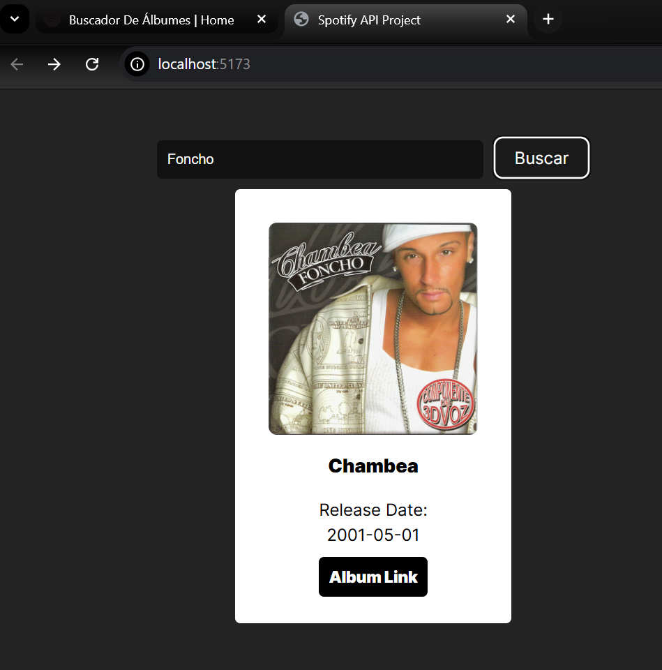

Este proyecto consiste en la creación de una aplicación web que permite a los usuarios buscar álbumes musicales utilizando la API de Spotify. Al ingresar el nombre de un artista, la aplicación mostrará una lista de sus álbumes disponibles en Spotify, junto con detalles como la portada del álbum, el nombre y la fecha de lanzamiento.

Resultado:

